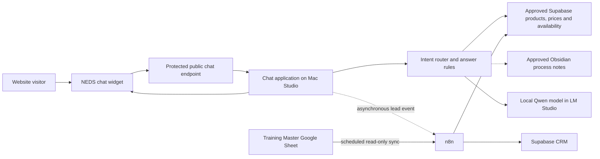

# NEDS chatbot — self-hosted implementation direction

Decision basis updated: 2026-08-15

## Outcome

Build a small, fast, self-hosted answer bot rather than buying a full commercial chatbot platform. It will answer a narrow set of NEDS questions, reduce routine calls/emails and optionally capture an enquiry into the Chartwise CRM.

This is not the internal Company Brain. It is a deliberately restricted public service with a much smaller knowledge boundary.

## Confirmed design principles

- Build and host the core service ourselves.
- Run the model locally on the Mac Studio.
- Keep factual knowledge outside model weights.
- Use the Supabase/Postgres CRM for approved structured product, pricing and lead records.
- Treat training availability as dynamic operational data, separate from the knowledge/RAG corpus.
- Use an explicitly allowlisted Obsidian note only when a controlled licence-process answer is needed.
- Use n8n for asynchronous automation and CRM routing, not in the latency-sensitive answer path.
- Collect minimal customer details and keep sensitive data out of public chat.
- Optimise for speed, reliability and easy maintenance rather than broad conversational ability.

## Terminology

- **Supabase** is the Postgres-based backend/database platform.
- A **PWA** (Progressive Web App) is a website that staff can install to a phone/tablet/computer like an app. This is probably the installable CRM interface intended here.
- An **APK** is an Android application package. It is relevant only if a native Android build is produced.

## Current versus target CRM state

John confirmed the target is a self-hosted Supabase CRM. Current local project notes still describe a London-hosted Supabase project with NocoDB and a custom dashboard in development. The chatbot must integrate through a stable CRM API/data contract so the hosting transition does not require rewriting the website widget.

## Proposed architecture

The website must never connect directly to LM Studio, Supabase administration, NocoDB, n8n's editor or the Obsidian vault.

## Public endpoint security

The public endpoint should be a dedicated, minimal API surface protected by Cloudflare controls. This requires an explicit security review because the existing Mac Studio policy keeps company/local services off the public tunnel.

Minimum controls:

- Publish only the chatbot API, never model or administration ports.
- Bind the internal chatbot service to localhost.
- Enforce HTTPS, origin checks, request-size limits and per-IP/session rate limits.
- Add bot-abuse protection such as Cloudflare Turnstile after a sensible threshold.
- Limit message length and conversation turns.
- Remove file upload and arbitrary URL-fetching capability.
- Set hard model timeouts and concurrency limits.
- Return contact details gracefully if the Mac, model or tunnel is unavailable.
- Keep prompts, logs and error traces free from secrets.

## Answer path

The bot should classify each message into a very small intent set:

1. `price_query`
2. `service_query`
3. `hgv_process_query` — optional, controlled source only
4. `training_availability_query`
5. `lead_or_callback_request`
6. `out_of_scope`

Prices and service availability should use deterministic database lookup. The language model turns approved records into a natural answer but must not alter amounts or inclusions.

For the optional HGV-process intent, retrieve one approved Obsidian note and give a short answer with its review date/source. Do not expose the wider Company Brain or legislation corpus to the public bot.

## Training availability

Training availability is not RAG content and should not be embedded. It should be queried as current structured data using stable course/session identifiers.

Initial source and flow:

1. Training Master remains the operational Google Sheet.
2. A scheduled n8n job reads the relevant rows, validates them and idempotently upserts a public availability read model in Supabase.
3. The chatbot queries that read model directly and returns no more than three appropriate options.
4. The response includes the source refresh time and asks the customer to enquire or book, depending on whether a real reservation function exists.

A nightly copy is acceptable for broad wording such as “We currently have availability during the week commencing 7 September, subject to confirmation.” It is not sufficiently current to promise or guarantee an individual place. If the bot must say “our next guaranteed space is…”, use a near-real-time sync or a live Training Master availability check and, ideally, an atomic reservation/hold operation.

Recommended sync cadence while Google Sheets is authoritative:

- Every 5–15 minutes during office hours for useful slot suggestions.
- A nightly full reconciliation to detect deleted, moved or duplicated rows.
- Immediately mark availability unavailable if the last successful sync exceeds an agreed threshold; proposed initial threshold: 30 minutes during office hours.

The public view should contain only operational booking information. Do not expose customer names, instructor notes, staff-only comments or unrelated sheet columns.

Minimum availability fields:

- Stable source session ID.
- Training type: classroom Driver CPC or practical vehicle training.
- Course/category and location.
- Start date or week commencing date.
- Remaining public capacity or a safe availability band.
- Booking status: `available`, `limited`, `full`, `cancelled`.
- Source update time and successful-sync time.
- Public booking/enquiry route.

Practical availability may depend on course length, vehicle category, instructor and the customer's existing entitlement. Those rules should be resolved by the availability service or returned for office confirmation; the language model must not calculate them itself.

## Model approach

Do not fine-tune facts into the model. Product details, prices and rules change and must remain editable in Supabase/Obsidian.

Recommended sequence:

1. Start with a small local Qwen model, system prompt and a handful of approved examples.
2. Benchmark Qwen3 4B and Qwen3 8B-class quantised models in LM Studio on the actual Mac Studio.
3. Keep the model loaded to avoid cold-start delay.
4. Choose the smallest model that passes the accuracy/style tests.
5. Log and curate real conversations locally.
6. Fine-tune later only for tone, brevity, refusal and hand-off behaviour if the transcript evidence shows a clear benefit.

The phrase “Qwen 3.8” may mean Qwen3 8B; confirm the exact model identifier during the benchmark rather than designing around an ambiguous name.

## Speed targets

Proposed acceptance targets, to be benchmarked rather than assumed:

- Structured price/service lookup: under 250 ms on the server.
- Median time to first generated text: at or below 1 second.
- 95th-percentile time to first generated text: at or below 2 seconds under normal load.
- Normal answer complete within 5 seconds.
- Maximum answer length around 120 words unless the visitor asks for more.
- Availability target and supported concurrency: TBC after traffic and resilience review.

## CRM and lead capture

Answer the customer's question before asking for details. Then offer an optional callback or information request.

Suggested fields:

- Name.
- Telephone or email.
- Product/service of interest.
- Existing broad entitlement, if relevant.
- Preferred timeframe.
- Consent to be contacted about this enquiry.

The chat application should send a small lead event asynchronously to n8n. n8n validates and writes it to Supabase using canonical service/source IDs and provenance. Follow the CRM's standing controls: no guessing, no inferred classifications and provenance on every row.

Do not collect medical history, driving-licence numbers, identity images or payment details in chat.

## Suggested Supabase tables

- `public_services`
- `public_prices`
- `public_training_availability`
- `chat_sessions`
- `chat_messages` or a minimised transcript/event store
- `chat_leads`
- `content_versions`

Exact schema belongs in the CRM project and must use its numbered migration process. NocoDB schema editing remains off. The NEDS project should define the required data contract but must not modify the CRM repository without separate authorisation.

## Conversation logging and future tuning

Logging is useful for measuring call deflection and building a future tone dataset, but it creates personal-data obligations. Before launch, agree:

- Whether full message text is needed or whether intents/outcomes are sufficient.
- Retention period.
- Who can review transcripts.
- How deletion requests propagate.
- How training examples are anonymised and approved.

## Delivery phases

### Phase 0 — approve content and boundaries

- Reconcile every NEDS public price.
- Approve the active product/service catalogue.
- Decide whether the single HGV-process answer is in v1.
- Agree the public availability fields, wording and staleness threshold with the Training Master owner.
- Correct the public privacy policy, including removal of HubSpot references.
- Confirm target Supabase hosting state and the CRM integration contract.

### Phase 1 — local proof

- Build an intent router and deterministic lookup service.
- Load a tiny approved test catalogue.
- Benchmark Qwen3 4B and 8B-class models locally.
- Create an evaluation set of real office questions and approved answers.
- Prove that the system withholds conflicted/expired prices.
- Build a read-only Training Master fixture and prove the availability sync is idempotent and fail-closed when stale.

### Phase 2 — secure website pilot

- Build the polished chat widget.
- Publish only the dedicated endpoint through the approved protected route.
- Add rate limits, message limits, abuse controls and failure fallback.
- Pilot without CRM write access; log only technical metrics initially.
- Show suggested availability as subject to confirmation until a live reservation path exists.

### Phase 3 — lead capture

- Add the privacy notice and optional contact fields.
- Send asynchronous lead events through n8n.
- Write to the CRM with canonical IDs and provenance.
- Reconcile every pilot lead against the website event log.

### Phase 4 — measure and improve

- Measure answered intents, hand-offs, abandoned chats and office deflection.
- Review incorrect/withheld answers weekly during the pilot.
- Curate transcripts only after retention and privacy controls are approved.
- Fine-tune tone only if it beats the prompted base model on the fixed evaluation set.

## Go-live gates

- Approved price and service records only.
- No HubSpot wording in the public privacy notice.
- Public-endpoint security review complete.
- Model/API ports inaccessible from the public internet.
- Rate-limit and abuse tests pass.
- Failure mode shows telephone/email hand-off.
- CRM writes are idempotent and source-labelled.
- Availability responses show their refresh time, suppress stale data and never claim a reservation unless one has been committed by the booking system.
- Backup and recovery path for chatbot configuration and content snapshot is documented.
- Named content owner and review cadence are agreed.
